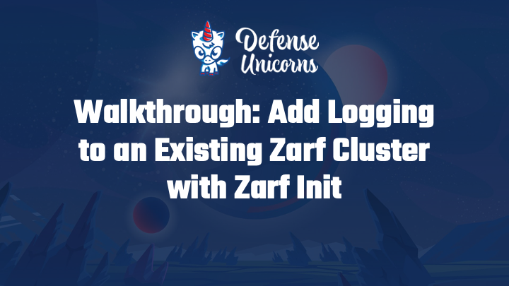
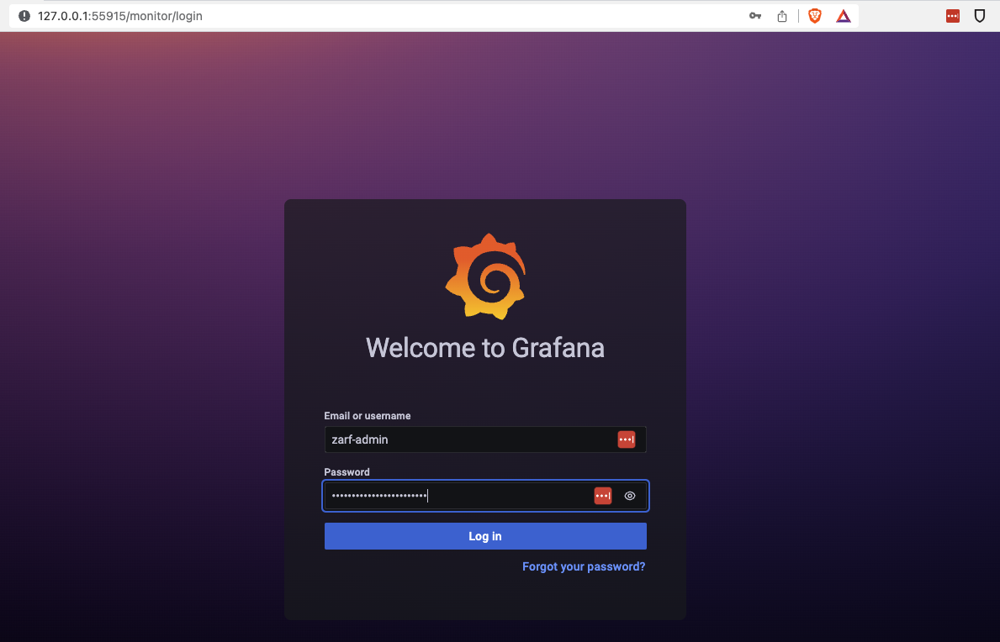

## Introduction

In this tutorial, we are going to show how you can use a Zarf component to inject zero-config, centralized logging into your Zarf cluster.

More specifically, you'll be adding a [Promtail / Loki / Grafana (PLG)](https://github.com/grafana/loki) stack to the [Retro Arcade Tutorial](./3-deploy-a-retro-arcade.md) by installing Zarf's "logging" component.

## System Requirements

- You'll need an internet connection to grab the Zarf Init Package if it's not already on your machine.

## Prerequisites

Prior to this tutorial you'll want to have a working cluster with Zarf initialized.

- Zarf binary installed on your $PATH: ([Installing Zarf](../1-getting-started/index.md#installing-zarf))
- [Initialize a cluster](./1-initializing-a-k8s-cluster.md).
- Perform the [Retro Arcade Tutorial](./3-deploy-a-retro-arcade.md).

## Youtube Tutorial
[](https://youtu.be/FYkafs1idlQ "Add Logging to an existing Zarf Cluster with Zarf Init")

## Installing the Logging Component

1. Run the `zarf init` command on your cluster.

```sh
$ zarf init
```

2. When prompted to deploy the package select `y` for Yes, then hit the `enter`
key. <br/> When prompted to deploy the logging component select `y` for Yes, then hit the `enter` key.

<iframe src="/docs/tutorials/logging_init_manual.html" height="800px" width="100%"></iframe>

4. You can automatically accept the logging component, and confirm the package using the `--confirm` and `--components` flags.

<iframe src="/docs/tutorials/logging_init.html" height="800px" width="100%"></iframe>

### Connecting to the Logging Component

#### Note the Credentials

1. Review the `zarf init` command output for the following:

<iframe src="/docs/tutorials/logging_credentials.html" width="100%"></iframe>

You should see a section for `Logging`.  You will need these credentials later on.

## Deploy the Retro Arcade Tutorial

1. If you haven't already in the prerequisites, deploy the [Retro Arcade Tutorial](./3-deploy-a-retro-arcade.md).

## Check the logs

:::note

Because Doom may be freshly installed it is recommended to refresh the page a few times to generate more log traffic to view in Grafana

:::


### Log into Grafana

To open Grafana you can use the `zarf connect logging` command.

You'll be redirected the `/login` page where you have to sign in with the Grafana credentials you saved [in a previous step](#note-the-credentials).



Once you've successfully logged in go to:

1. The "Explore" page (Button on the left that looks like a compass)
2. Select `Loki` in the dropdown, and then
3. Enter `{app="game"}` into the Log Browser query input field


Submit that query and you'll get back a dump of all the game pod logs that Loki has collected.


## Removal

1. Use the `zarf package list` command to get a list of the installed packages and their components.  This will give you the name of the init package and the logging component to remove it.

<iframe src="/docs/tutorials/logging_list.html" width="100%"></iframe>

2. Use the `zarf package remove` command to remove the `logging` component from the init package.  Don't forget the `--confirm` flag.  Otherwise you'll receive an error.

<iframe src="/docs/tutorials/logging_remove.html" width="100%" height="120px"></iframe>


## Troubleshooting

### Unable to connect to the Kubernetes cluster.

<iframe src="/docs/tutorials/troubleshoot_unreachable.html" width="100%" height="200px"></iframe>

:::info Remediation

If you receive this error, either you don't have a Kubernetes cluster, your cluster is down, or your cluster is unreachable.

1. Check your kubectl configuration, then try again.  For more information about kubectl configuration see [Configure Access to Multiple Clusters](https://kubernetes.io/docs/tasks/access-application-cluster/configure-access-multiple-clusters/) from the Kubernetes documentation.

If you need to setup a cluster, you can perform the following.

1. Deploy a Kubernetes cluster with the [Creating a K8s Cluster with Zarf](./5-creating-a-k8s-cluster-with-zarf.md) tutorial.
2. Perform the [Initialize a cluster](./1-initializing-a-k8s-cluster.md) tutorial.

After that you can try deploying the package again.

:::
