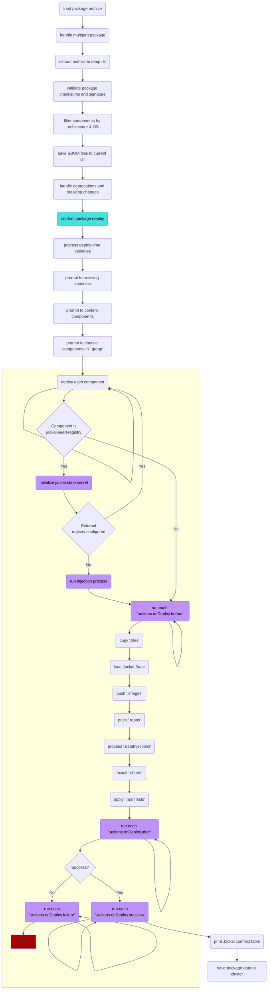

# The Jackal 'init' Package

The 'init' package is a special Jackal Package (denoted by `kind: JackalInitConfig` in its `jackal.yaml`) that initializes a cluster with the requisite air gap services when running `jackal init`.  This allows future Jackal Packages to store any required resources (i.e. container images and git repositories) so that they can be retrieved later.

The default 'init' package that Jackal ships is defined in the `jackal.yaml` that lives at the [root of the Jackal repository](https://github.com/racer159/jackal/blob/main/jackal.yaml), and is constructed from composed components that provide a foundation for customization.  If you would like to change the behavior of the 'init' package you can do so by modifying this `jackal.yaml` or any of the composed components that it references and running `jackal package create` at the root of the repository.  You can learn more about creating a custom init package in the [Creating a Custom 'init' Package Tutorial](../5-jackal-tutorials/8-custom-init-packages.md).

Upon deployment, the init package creates a `jackal` namespace within your K8s cluster and deploys pods, services, and secrets to that namespace based on the components selected for deployment.

## Required Component

Jackal's mutation capabilities require that the [`jackal-agent`](../8-faq.md#what-is-the-jackal-agent) component of the init package is deployed and active within the cluster, meaning that it cannot be disabled and is always running. This component intercepts requests to create resources and uses the `jackal-state` secret to mutate them to point to their air gap equivalents. It is automatically deployed whenever a `jackal init` command is executed.

| Component               | Description                                                                                                                                           |
| ----------------------- | ----------------------------------------------------------------------------------------------------------------------------------------------------- |
| jackal-agent              | A Kubernetes mutating webhook installed during `jackal init` that converts Pod specs and Flux GitRepository objects to match their air gap equivalents. |

:::note

The `jackal-agent` will mutate any resources it sees that have not already been patched and don't have the `jackal.dev/agent: ignore` label applied. This label is automatically applied to all namespaces that exist prior to `jackal init`, and will prevent the `jackal-agent` from mutating system resources.  You can manually apply this label to any additional namespaces or resources after the fact to prevent the `jackal-agent` from acting upon them.  See the FAQ entry to learn more about [what happens to resources that were deployed prior to `jackal init`](../8-faq.md#what-happens-to-resources-that-exist-in-the-cluster-before-jackal-init).

:::

## Core Components

In addition to the required `jackal-agent` component, Jackal also offers components that provide additional functionality and can be enabled as needed based on your desired end-state.

In most scenarios, Jackal will also deploy an internal registry using the three components described below. However, Jackal can be configured to use an already existing registry with the `--registry-*` flags when running `jackal init` (detailed information on all `jackal init` command flags can be found in the [jackal init CLI](../2-the-jackal-cli/100-cli-commands/jackal_init.md) section). This option skips the injector and seed process, and will not deploy a registry inside of the cluster. Instead, it uploads any images to the externally configured registry.

| Components              | Description                                                                                                                     |
| ----------------------- | ------------------------------------------------------------------------------------------------------------------------------- |
| jackal-injector           | Adds a Rust binary to the working directory to be injected into the cluster during registry bootstrapping.                      |
| jackal-seed-registry      | Adds a temporary container registry so Jackal can bootstrap itself into the cluster.                                              |
| jackal-registry           | Adds a long-lived container registry service&mdash;[docker registry](https://docs.docker.com/registry/)&mdash;into the cluster. |

:::note

Given the registry is a core part of any Kubernetes deployment you MUST either specify an external registry with the `--registry-*` flags or use the injected registry which is why it cannot be selected with `--components` like the components below.

:::

:::info

The Jackal Registry is initially injected as a series of config maps that bootstraps itself into the cluster and then binds to a NodePort to allow the kubelet to pull images and setup the final registry deployment.  Doing this keeps Jackal cluster agnostic however does require that the kubelet be able to reach out to a cluster NodePort service which may require changes to firewall configurations like allowing UDP traffic between nodes if using something like VXLAN tunneling.

:::

:::tip

You can further customize how the registry behaves by setting variables such as `REGISTRY_PVC_SIZE` with a [config file](../2-the-jackal-cli/index.md#using-a-config-file-to-make-cli-command-flags-declarative) or `--set` on `jackal init`.

To see a full list of `variables` you can view the [jackal.yaml that defines the registry](https://github.com/racer159/jackal/blob/main/packages/jackal-registry/jackal.yaml).

:::

Beyond the registry, their are also fully-optional components available for the init package.  Many of these also have external configurations you can set with `jackal init` (such as `--git-*`), but these components provide an easy way to get started in environments where these core services are needed and may not already exist.

| Components   | Description                                                                                                                                                       |
| ------------ | ----------------------------------------------------------------------------------------------------------------------------------------------------------------- |
| k3s          | REQUIRES ROOT (not sudo). Installs a lightweight Kubernetes Cluster on the local host&mdash;[K3s](https://k3s.io/)&mdash;and configures it to start up on boot.   |
| logging      | Adds a log monitoring stack&mdash;[promtail/loki/grafana (aka PLG)](https://github.com/grafana/loki)&mdash;into the cluster.                                      |
| git-server   | Adds a [GitOps](https://about.gitlab.com/topics/gitops/)-compatible source control service&mdash;[Gitea](https://gitea.io/en-us/)&mdash;into the cluster. |

There are two ways to deploy these optional components. First, you can provide a comma-separated list of components to the `--components` flag, such as `jackal init --components k3s,git-server --confirm`, or, you can choose to exclude the `--components` and `--confirm` flags and respond with a yes (`y`) or no (`n`) for each optional component when interactively prompted.

:::caution

(Linux only) Deploying the 'k3s' component will require `root` access (not just `sudo`), as it modifies your host machine to install the cluster and by default only provides access to the cluster to the `root` user.

:::

:::tip

The `k3s` component included in Jackal differs from the default `k3s` install in that it disables the installation of `traefik` out of the box.  This was done so that people could more intentionally choose if they wanted `traefik` or another ingress provider (or no ingress at all) depending on their needs.  If you would like to return `k3s` to its defaults, you can set the `K3S_ARGS` jackal variable to an empty string:

```text
root@machine ~ # jackal init --components k3s --set K3S_ARGS="" --confirm
```

:::

:::tip

You can further customize how the git-server behaves by setting variables such as `GIT_SERVER_PVC_SIZE` with a [config file](../2-the-jackal-cli/index.md#using-a-config-file-to-make-cli-command-flags-declarative) or `--set` on `jackal init`.

To see a full list of `variables` you can view the [jackal.yaml that defines the git-server](https://github.com/racer159/jackal/blob/main/packages/gitea/jackal.yaml).

:::

## What Makes the Init Package Special

Deploying into air gapped environments is a [hard problem](../1-getting-started/1-understand-the-basics.md#what-is-the-air-gap), particularly when the K8s environment doesn't have a container registry for you to store images in already. This results in a dilemma where the container registry image must be introduced to the cluster, but there is no container registry to push it to as the image is not yet in the cluster - chicken, meet egg. To ensure that our approach is distro-agnostic, we developed a unique solution to seed the container registry into the cluster.

This is done with the `jackal-injector` [component](https://github.com/racer159/jackal/blob/main/packages/jackal-injector/jackal.yaml) which injects a single rust binary (statically compiled) and a series of configmap chunks of a `registry:2` image into an ephemeral pod that is based on an existing image in the cluster.  This gives us a running registry to bootstrap from and deploy the rest of the 'init' package and any other packages down the line.

:::note

The `registry:2` image and the Jackal Agent image can be configured with a custom init package using the `registry_image_*` and `agent_image_*` templates defined in the Jackal repo's [jackal-config.toml](https://github.com/racer159/jackal/blob/main/jackal-config.toml).  This allows you to swap them for enterprise provided / hardened versions if desired such as those provided by [Iron Bank](https://repo1.dso.mil/dsop/opensource/racer159/jackal/jackal-agent).

:::

## The `jackal init` Lifecycle

The `jackal init` lifecycle is _very similar_ to the [`jackal package deploy` lifecycle](./5-package-create-lifecycle.md#jackal-package-deploy) except that it sets up resources specific to Jackal such as the `jackal-state` and performs special actions such as the injection procedure.



:::tip

Given that these flows are so similar you actually can `jackal package deploy` the init package.  This is similar to accepting the defaults for any init-specific command flags and is useful when trying to deploy packages in a more generic way.

:::
