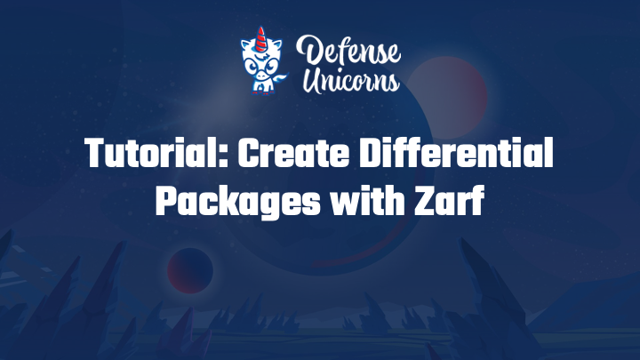

# Differential Packages with Jackal

## Introduction

In this tutorial, you will create a differential package using Jackal.  This is useful when deploying updates to a package that shares common git repositories and container images across versions.  Differential packages only pack what has changed, ensuring that those resources will only need to be packaged and deployed once.

## System Requirements

- Internet access to download resources or upload packages
- Access to a registry (this tutorial uses Docker Hub)

## Prerequisites

For following along locally, please ensure the following prerequisites are met:

- Jackal binary installed on your `$PATH`: ([Installing Jackal](../1-getting-started/index.md#installing-jackal))
- The [Jackal](https://github.com/racer159/jackal) repository cloned: ([`git clone` Instructions](https://docs.github.com/en/repositories/creating-and-managing-repositories/cloning-a-repository))

## Youtube Tutorial

## Create a Differential Package

In this example we're going to use the [Longhorn Example](../../examples/longhorn/) to create a differential package.

:::note

You'll notice we're not using a cluster in this example.  That's because differential packages only affect package creation and do not require a running cluster to make.

:::

1. From the `examples/longhorn` folder, Create the Jackal package with the `jackal package create` command.

<iframe src="/docs/tutorials/differential_package_create.html" width="100%" height="600px"></iframe>

2. Modify the `jackal.yaml` file to upgrade all of the 1.4.0 images to version 1.4.2; leave everything else the same.  

3. Update the version of the package as well in the [metadata.version](/docs/create-a-jackal-package/jackal-schema#metadata) field.

:::caution

Creating differential packages without updating the package version will result in an error.

<iframe src="/docs/tutorials/differential_package_error.html" width="100%" height="180px"></iframe>

:::

<iframe src="/docs/tutorials/differential_package_edit.html" width="100%" height="600px"></iframe>

4. Next, use the `jackal package create` command with the `--differential` flag to specify a reference package.  This will build the differential package omitting the images, repositories, and OCI skeleton components that are already present in the specified Jackal package and are pinned to a specific version/shasum.

<iframe src="/docs/tutorials/differential_package_create_differential.html" width="100%" height="600px"></iframe>

## Conclusion

You have now learned to create differential packages with Jackal.  If you would like to see the size you saved, you can use the `jackal package create` command without the `--differential` flag.  You'll notice a size difference between the two packages since the differential package omits duplicate contents.

<iframe src="/docs/tutorials/differential_package_create_conclusion.html" width="100%" height="600px"></iframe>
