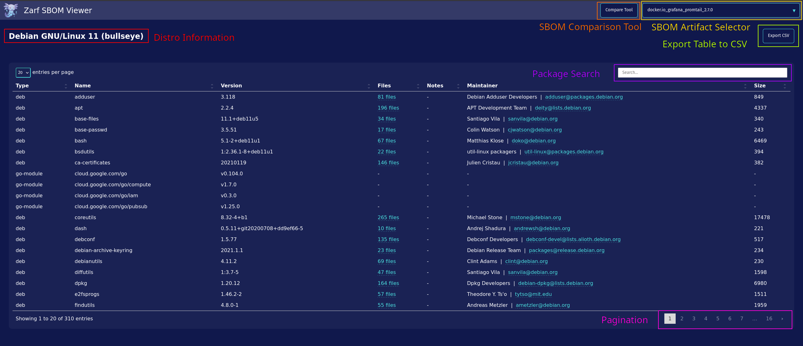

A [Software Bill of Materials (SBOM)](https://www.linuxfoundation.org/tools/the-state-of-software-bill-of-materials-sbom-and-cybersecurity-readiness/) is a document that contains a detailed list of all the things a software application is using. SBOMs are important from a security standpoint because they allow you to better track what dependencies you have, and with that information, you can quickly check if any of your dependencies are out of date or have a known vulnerability that should be patched. Zarf makes SBOMs easier, if not painless, to deal with!

## SBOMs Built Into Packages

Zarf treats security as a first-class concern and builds SBOM documents into packages by default! Unless explicitly skipped with the `--skip-sbom` flag, whenever a package is created, Zarf generates an SBOM for it and adds it to the package itself. This means that wherever you end up moving your package, you will always be able to take a peek inside to see what it contains. You can learn more about how Zarf does this on the [Package SBOMs page](../3-create-a-zarf-package/6-package-sboms.md).

You can quickly view these files in your browser by running `zarf package inspect` with the `-s` or `--sbom` flag. If there are any SBOMs included in the package, Zarf will open the SBOM viewer to the first SBOM in the list.

``` bash
$ zarf package inspect zarf-package-example-amd64.tar.zst -s
```

:::tip

If you would like to get to the raw SBOM files inside of a package you can use the `--sbom-out` flag as shown below:

``` bash
$ zarf package inspect zarf-package-example-amd64.tar.zst --sbom-out ./temp-sbom-dir
$ cd ./temp-sbom-dir/example
$ ls
```

This will output the raw SBOM viewer `.html` files as well as the Syft `.json` files contained in the package.  Both of these files contain the same information, but the `.html` files are a lightweight representation of the `.json` SBOM files to be more human-readable.  The `.json` files exist to be injected into other tools, such as [Grype](https://github.com/anchore/grype) for vulnerability checking.

The Syft `.json` files can also be converted to other formats with the Syft CLI (which is vendored into Zarf) including `spdx-json` and `cyclonedx-json`.

```
zarf tools sbom convert nginx_1.23.0.json -o cyclonedx-json > nginx_1.23.0.cyclonedx.json
```

To learn more about the formats Syft supports see `zarf tools sbom convert -h`

:::

## Viewing SBOMs When Deploying


When deploying a package, Zarf will output the yaml definition of the package, i.e. the `zarf.yaml` that defined the package that was created. If there are any artifacts included in the package, Zarf will also output a note saying how many artifacts are going to be deployed with a link to a lightweight [SBOM viewer](#the-sbom-viewer) that you can copy into your browser to get a visual overview of the artifacts and what they contain.


:::note

Zarf does not prompt you to view the SBOM if you are deploying a package with the `--confirm` flag

:::

## The SBOM Viewer

**Example SBOM Dashboard**


In each package that contains SBOM information, Zarf includes a simple dashboard that allows you to see the contents of each container image or set of component files within your package. You can toggle through the different images or components in the dropdown at the top right of the dashboard as well as export the table contents to a CSV.

**Example SBOM Comparer**


The SBOM viewer also has an SBOM comparison tool built in that you can access by clicking the "Compare Tool" button next to the image selector.  This view allows you to take the SBOM `.json` data (extracted alongside the `.html` files with `--sbom-out`) and compare that across images or packages (if you extract multiple Zarf packages at a time).  This is useful for seeing what has changed between different image or component versions.
